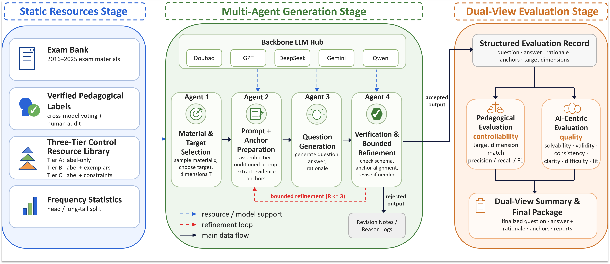

# Gaokao Multi-Agent Question Generation Framework

<p align="center">
  
</p>

<p align="center">
  <a href="#introduction">English</a> •
  <a href="#中文文档">中文</a>
</p>

---

## Introduction

Automatic Question Generation-Solving-Evaluation System for Chinese Gaokao Reading Comprehension, featuring a 4-Agent pipeline architecture and dual evaluation system.

**Key Features**:
- 4 Agents in series: Material Selection → Anchor Finding → QG Solving → Quality Verification
- Dual evaluation: Pedagogical dimensions (GK/CS) + AI-centric evaluation
- Ablation support: Random dimensions, no-dimension control groups

## Quick Start

```bash
# 1. Install dependencies
pip install -r requirements.txt

# 2. Configure API keys
cp .env.example .env
# Edit .env with your API keys

# 3. Run example
python run.py --run-mode single --unit-id 1 --dim-mode gk --prompt-level C
```

## Project Structure

```
├── run.py              # CLI entry point
├── src/
│   ├── shared/         # Shared modules (API config, data loader, etc.)
│   ├── generation/     # Stage1: 4-Agent generation pipeline
│   ├── evaluation/     # Stage2: Dual evaluation system
│   └── showcase/       # Case showcase tools
├── data/               # Core data (181 real exam materials)
├── scripts/            # Utility scripts
└── tools/              # Development tools
```

## CLI Reference

### Run Modes (--run-mode)

| Mode | Description | Example |
|------|-------------|---------|
| `single` | Single question mode | `python run.py --run-mode single --unit-id 1` |
| `full` | Full/subset mode | `python run.py --run-mode full --subset-size 40` |
| `baseline` | Real exam baseline eval | `python run.py --run-mode baseline --eval-mode gk` |
| `extract` | Extract generated questions | `python run.py --run-mode extract --extract-dir outputs/EXP_xxx` |
| `stage1-only` | Run Stage1 only | `python run.py --run-mode stage1-only --subset-size 40` |
| `stage2-only` | Run Stage2 only | `python run.py --run-mode stage2-only --stage1-dir outputs/xxx` |
| `ablation-nodim` | No-dimension ablation | `python run.py --run-mode ablation-nodim --unit-id 1` |

### Common Parameters

| Parameter | Description | Options | Default |
|-----------|-------------|---------|---------|
| `--dim-mode` | Dimension mode | gk, cs | gk |
| `--prompt-level` | Prompt level | A, B, C | C |
| `--eval-mode` | Evaluation mode | ai, gk, cs, ai+gk, ai+cs | gk |
| `--subset-size` | Subset size | 40, 60 | None (full) |
| `--subset-strategy` | Sampling strategy | proportional_stratified, stratified, random | proportional_stratified |
| `--exam-type` | Exam filter (baseline) | all, national, local | all |

### Usage Examples

```bash
# Single mode - process specific unit
python run.py --run-mode single --unit-id 1 --dim-mode gk --prompt-level C

# Subset mode - 40 questions with stratified sampling
python run.py --run-mode full --subset-size 40 --dim-mode gk --prompt-level C

# Full mode - process all 181 questions
python run.py --run-mode full --dim-mode gk --prompt-level C

# Baseline evaluation - national exams only
python run.py --run-mode baseline --eval-mode gk --exam-type national

# Extract generated questions
python run.py --run-mode extract --extract-dir outputs/EXP_xxx --extract-format text

# Two-stage execution (for network switching scenarios)
python run.py --run-mode stage1-only --subset-size 40  # Stage1: Generation
python run.py --run-mode stage2-only --stage1-dir outputs/xxx  # Stage2: Evaluation

# Ablation - no dimension prompt
python run.py --run-mode ablation-nodim --unit-id 1

# Ablation - random dimensions
python run.py --run-mode full --use-random-dims --subset-size 40
```

## Contributing

1. Fork the repository
2. Create a feature branch (`git checkout -b feature/xxx`)
3. Commit changes (`git commit -m 'feat: xxx'`)
4. Push to branch (`git push origin feature/xxx`)
5. Create a Pull Request

## License

MIT License - See [LICENSE](LICENSE) for details.

**Note**: The code is MIT licensed. The dataset (`data/raw_material.json`) is for academic research only.

---

<details>
<summary><h2 id="中文文档">📖 中文文档 (Click to expand)</h2></summary>

### 项目简介

高考语文阅读理解自动出题-求解-评估系统，采用4-Agent流水线架构和双评估体系。

**核心特性**：
- 4个Agent串行生成：材料选择 → 锚点发现 → 出题求解 → 质量校验
- 双视角评估：教育学维度 (GK/CS) + AI角度评估
- 支持消融实验：随机维度、无维度等多种对照组

### 快速开始

```bash
# 1. 安装依赖
pip install -r requirements.txt

# 2. 配置API密钥
cp .env.example .env
# 编辑 .env 填入您的API密钥

# 3. 运行示例
python run.py --run-mode single --unit-id 1 --dim-mode gk --prompt-level C
```

### 目录结构

```
├── run.py              # 命令行入口
├── src/
│   ├── shared/         # 共享模块 (API配置、数据加载等)
│   ├── generation/     # Stage1: 4-Agent生成流水线
│   ├── evaluation/     # Stage2: 双评估系统
│   └── showcase/       # 案例展示工具
├── data/               # 核心数据 (181道真题材料)
├── scripts/            # 辅助脚本
└── tools/              # 开发工具
```

### CLI命令参考

#### 运行模式 (--run-mode)

| 模式 | 说明 | 命令示例 |
|------|------|----------|
| `single` | 单题模式 | `python run.py --run-mode single --unit-id 1` |
| `full` | 全量/子集模式 | `python run.py --run-mode full --subset-size 40` |
| `baseline` | 真题基准评估 | `python run.py --run-mode baseline --eval-mode gk` |
| `extract` | 提取生成的题目 | `python run.py --run-mode extract --extract-dir outputs/EXP_xxx` |
| `stage1-only` | 仅运行Stage1生成 | `python run.py --run-mode stage1-only --subset-size 40` |
| `stage2-only` | 仅运行Stage2评估 | `python run.py --run-mode stage2-only --stage1-dir outputs/xxx` |
| `ablation-nodim` | 无维度消融实验 | `python run.py --run-mode ablation-nodim --unit-id 1` |

#### 常用参数

| 参数 | 说明 | 可选值 | 默认值 |
|------|------|--------|--------|
| `--dim-mode` | 维度模式 | gk, cs | gk |
| `--prompt-level` | 提示词档次 | A, B, C | C |
| `--eval-mode` | 评估模式 | ai, gk, cs, ai+gk, ai+cs | gk |
| `--subset-size` | 子集大小 | 40, 60 | 无(全量) |
| `--subset-strategy` | 采样策略 | proportional_stratified, stratified, random | proportional_stratified |
| `--exam-type` | 卷别筛选(baseline) | all, national, local | all |

#### 使用示例

```bash
# 单题模式 - 处理指定unit
python run.py --run-mode single --unit-id 1 --dim-mode gk --prompt-level C

# 子集采样模式 - 40题分层采样
python run.py --run-mode full --subset-size 40 --dim-mode gk --prompt-level C

# 全量模式 - 处理所有181题
python run.py --run-mode full --dim-mode gk --prompt-level C

# 真题基准评估 - 仅全国卷
python run.py --run-mode baseline --eval-mode gk --exam-type national

# 提取生成的题目
python run.py --run-mode extract --extract-dir outputs/EXP_xxx --extract-format text

# 两阶段分开运行（适用于网络切换场景）
python run.py --run-mode stage1-only --subset-size 40  # Stage1: 生成
python run.py --run-mode stage2-only --stage1-dir outputs/xxx  # Stage2: 评估

# 消融实验 - 无维度提示词
python run.py --run-mode ablation-nodim --unit-id 1

# 消融实验 - 随机维度
python run.py --run-mode full --use-random-dims --subset-size 40
```

### 贡献指南

1. Fork 本仓库
2. 创建特性分支 (`git checkout -b feature/xxx`)
3. 提交更改 (`git commit -m 'feat: xxx'`)
4. 推送分支 (`git push origin feature/xxx`)
5. 创建 Pull Request

</details>
