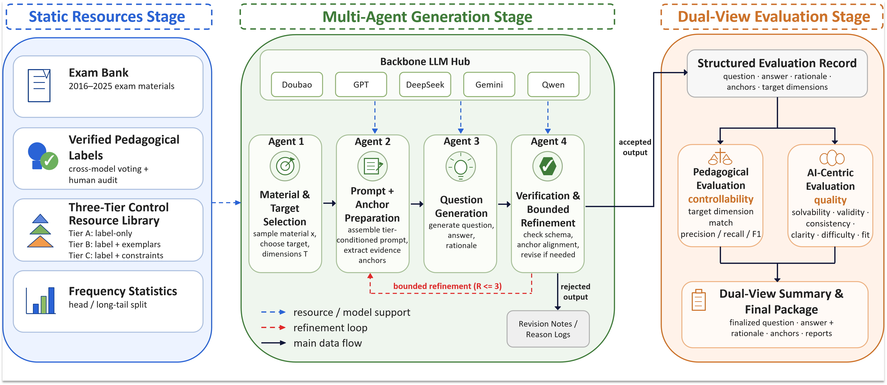

# 高考多智能体阅读题生成框架

语言: [English](README.md) | [中文](README.zh-CN.md)

<p align="center">
  
</p>

本项目是面向高考语文阅读理解任务的自动命题、求解与评估框架。系统包含 Stage1 四智能体生成流水线，以及覆盖 AI 维度、GK 维度和 CS 维度的 Stage2 评估流程。

## 核心功能

- Stage1 四智能体流水线：材料选择、证据锚点发现、题目生成与求解、轻量质量校验。
- Stage2 评估模式：`ai`、`gk`、`cs`、`gk+cs`、`ai+gk`、`ai+cs`、`ai+gk+cs`。
- Stage2 会自动去掉与 Stage1 生成模型同家族的评估模型。
- 支持随机维度、hard-mix 维度、低频维度和无维度提示词等消融实验。
- 支持 Stage1 与 Stage2 分开运行，便于切换网络环境并复现实验。

## 快速开始

```bash
pip install -r requirements.txt
copy .env.example .env
python run.py --help
python run.py --run-mode single --unit-id 1 --dim-mode gk --prompt-level C
```

macOS 或 Linux 使用 `cp .env.example .env`，不要使用 Windows 的 `copy`。

## 配置说明

1. API key 和服务入口地址配置在项目根目录的 `.env` 文件中。先复制 `.env.example`，再填写所需厂商的 key 和可选的 DMX 入口地址。

2. Stage1 使用哪个模型、走哪个厂商入口，在 `src/shared/api_config.py` 中修改 `STAGE1_PRESET` 和 `STAGE1_MODEL`。`STAGE1_PRESET` 选择路由，`STAGE1_MODEL` 选择具体模型。

3. Stage2 评估网络环境在 `src/shared/api_config.py` 中修改 `STAGE2_NETWORK`。`overseas` 表示海外路由，`domestic` 表示国内代理路由。

4. Stage2 评估模型组在 `src/shared/api_config.py` 中通过 `STAGE2_EVAL_MODELS` 和 `STAGE2_MODEL_WEIGHTS` 配置。如果只是复现当前版本，保持默认值即可。

Stage2 会识别 Stage1 的生成模型，并排除同模型家族的评估模型。如果教育学维度评估剩余两个模型，则只有两个模型都判定命中时，该维度才计为命中。AI 维度评估使用剩余模型，并重新归一化模型权重。

## CLI 参考

| 模式 | 用途 | 示例 |
| --- | --- | --- |
| `single` | 运行单个 unit 的 Stage1 与 Stage2 | `python run.py --run-mode single --unit-id 1` |
| `full` | 运行全部或抽样子集 | `python run.py --run-mode full --subset-size 40` |
| `baseline` | 直接评估原始真题 | `python run.py --run-mode baseline --eval-mode gk` |
| `extract` | 从输出目录提取生成题目 | `python run.py --run-mode extract --extract-dir outputs/EXP_xxx` |
| `stage1-only` | 只生成 Stage1 产物 | `python run.py --run-mode stage1-only --subset-size 40` |
| `stage2-only` | 评估已有 Stage1 输出目录 | `python run.py --run-mode stage2-only --stage1-dir outputs/EXP_xxx` |
| `ablation-nodim` | 运行无维度提示词消融 | `python run.py --run-mode ablation-nodim --subset-size 40 --eval-mode ai+gk+cs` |

常用参数：

| 参数 | 含义 | 常用值 |
| --- | --- | --- |
| `--dim-mode` | Stage1 教育维度体系 | `gk`, `cs` |
| `--prompt-level` | 提示词详细程度 | `A`, `B`, `C` |
| `--eval-mode` | Stage2 评估器组合 | `ai`, `gk`, `cs`, `gk+cs`, `ai+gk+cs` |
| `--subset-size` | 子集样本量 | `40`, `60` |
| `--subset-strategy` | 抽样策略 | `proportional_stratified`, `stratified`, `random` |
| `--exam-type` | baseline 真题范围 | `all`, `national`, `local` |

## 复现实验命令

```bash
# 单题运行
python run.py --run-mode single --unit-id 1 --dim-mode gk --prompt-level C

# 40 题分层抽样运行
python run.py --run-mode full --subset-size 40 --dim-mode gk --prompt-level C

# 先运行 Stage1，再切换网络环境运行 Stage2
python run.py --run-mode stage1-only --subset-size 40
python run.py --run-mode stage2-only --stage1-dir outputs/EXP_xxx --eval-mode ai+gk+cs

# 原始真题 baseline
python run.py --run-mode baseline --eval-mode gk --exam-type national

# 无维度提示词消融
python run.py --run-mode ablation-nodim --subset-size 40 --eval-mode ai+gk+cs

# 提取生成题目
python run.py --run-mode extract --extract-dir outputs/EXP_xxx --extract-format markdown
```

## 无 API 冒烟检查

以下命令只检查本地代码和配置，不会发起真实模型调用：

```bash
python run.py --help
python src/shared/api_config.py
python tools/check_stage_independence.py
python tools/check_static_alignment.py
python scripts/extract_questions.py --help
python -m compileall -q run.py src scripts tools output_analysis
```

## 项目结构

```text
├── run.py              # CLI 入口
├── src/
│   ├── shared/         # 共享配置、数据加载、LLM 封装和报告工具
│   ├── generation/     # Stage1 生成智能体与流水线
│   ├── evaluation/     # Stage2 AI/GK/CS 评估
│   └── showcase/       # 案例展示辅助工具
├── data/               # 核心实验数据与维度映射
├── scripts/            # 工具脚本
├── tools/              # 开发和审计工具
└── output_analysis/    # 输出分析包
```

## 许可证

代码采用 MIT License。详见 `LICENSE`。

随附的高考相关数据仅用于学术研究用途。
